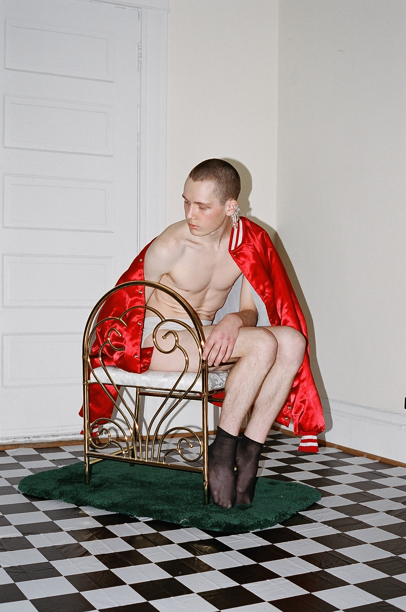
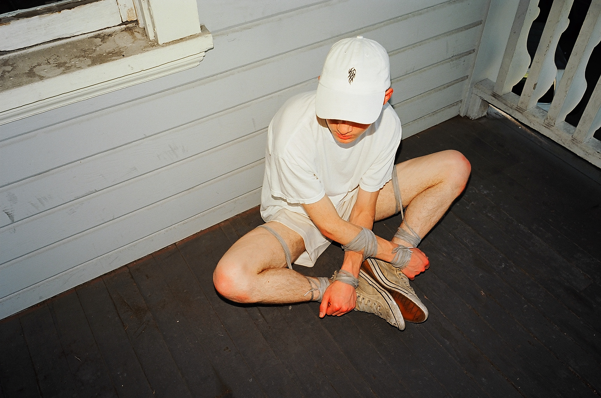
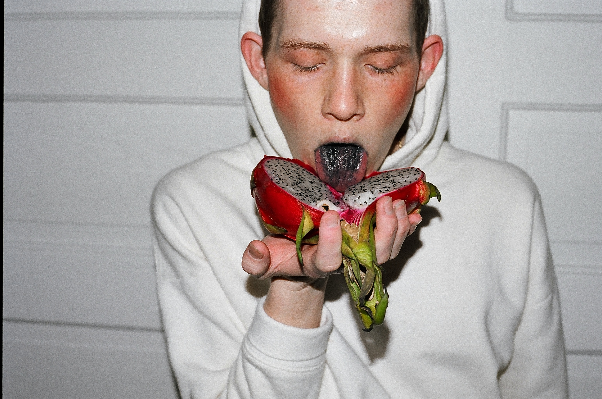
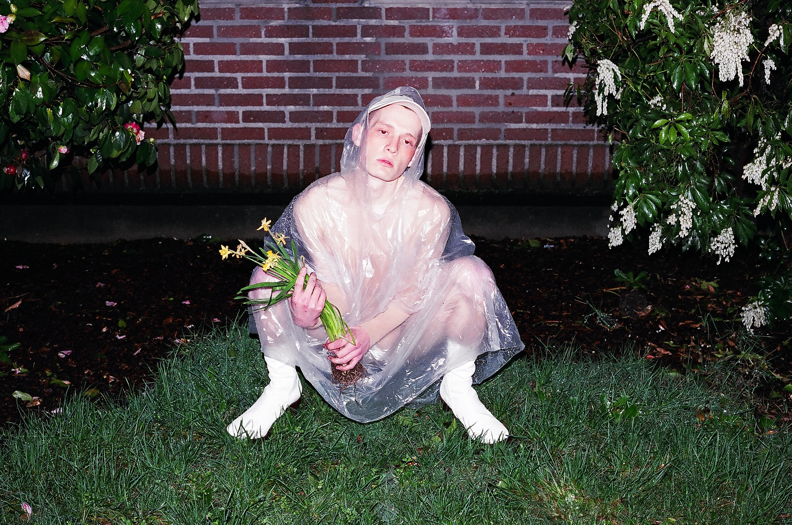

## Modeling for @agvstin

I've modeled for featured photographer Agustin Hernandez, aka @agvstin, on numerous occasions. See their profile on Instagram <a href='https://instagram.com/agvstin' target='_blank' rel='noopener noreferrer'>@agvstin</a>.

  

    

      
    

    

      
    

  

  

    

      
    

  

  

    

      
    

  

  

    

      
    

    

      
    

  

  

    

      
    

  

  

    

      
    

  

  

    

      
      

    

      
    

  

  

    

      
    

  

  

    

      
    

  

